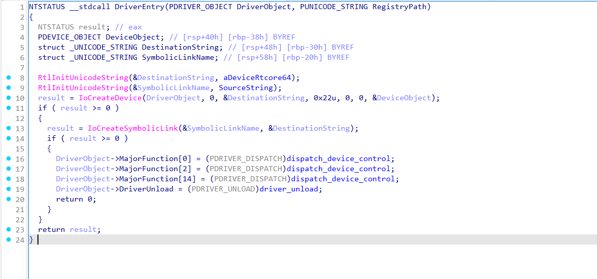
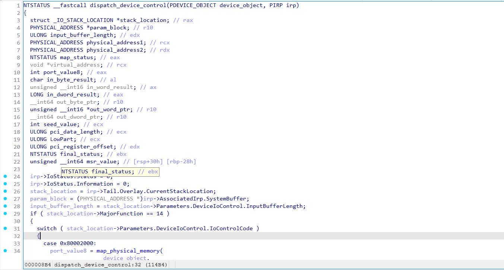
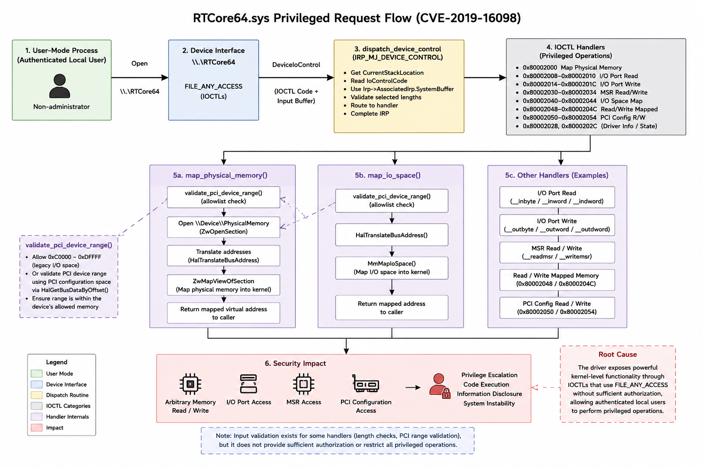

# Technical Analysis

## 1. Overview

This document summarizes the reverse engineering and security analysis of the signed `RTCore64.sys` Windows kernel driver.

The analysis focused on:

- Driver initialization
- Device and symbolic-link creation
- IOCTL dispatch logic
- Privileged hardware and memory operations
- Access-control weaknesses
- Security impact and mitigations

The analysis was performed in an isolated Windows virtual machine.

---

## 2. Sample Information

| Property | Value |
|---|---|
| Filename | `RTCore64.sys` |
| Architecture | x64 |
| Driver type | Windows kernel-mode driver |
| Signer | `MICRO-STAR INTERNATIONAL CO., LTD.` |
| SHA-1 | `f6f11ad2cd2b0cf95ed42324876bee1d83e01775` |
| SHA-256 | `01aa278b07b58dc46c84bd0b1b5c8e9ee4e62ea0bf7a695862444af32e87f1fd` |
| File version | `4.6.2.15658` |
| Analysis tool | IDA |

The original driver binary is not included in this repository.

Function and variable names were manually renamed during reverse engineering to improve readability.

---

## 3. Driver Initialization

The `DriverEntry` routine initializes the driver and exposes its device interface.

The routine:

1. Initializes the device and symbolic-link names.
2. Creates the device object with `IoCreateDevice`.
3. Creates the symbolic link with `IoCreateSymbolicLink`.
4. Registers a shared dispatch routine.
5. Registers the driver unload routine.

The following IRP major functions are assigned to `dispatch_device_control`:

| Index | IRP function |
|---|---|
| `0` | `IRP_MJ_CREATE` |
| `2` | `IRP_MJ_CLOSE` |
| `14` | `IRP_MJ_DEVICE_CONTROL` |

The reconstructed initialization logic is available in:

- [`driver_entry.c`](../pseudocode/driver_entry.c)

---
## 4. Device Interface

The driver creates a named kernel device object and exposes it through a DOS
symbolic link, allowing user-mode applications to communicate with the driver
through `DeviceIoControl`.

| Property | Value |
|---|---|
| Kernel device name | `\Device\RTCore64` |
| Symbolic-link name | `\DosDevices\RTCore64` |
| User-mode path | `\\.\RTCore64` |
| Standard-user access | `Yes — documented for authenticated local users` |
| IOCTL transfer method | `METHOD_BUFFERED` |
| IOCTL access requirement | `FILE_ANY_ACCESS` |
| Associated vulnerability | `CVE-2019-16098` |

The analyzed IOCTLs use `FILE_ANY_ACCESS`, meaning they do not require a handle
opened with specific read or write access rights. The device security descriptor
still determines whether a process can obtain the original device handle.

Standard-user access is a documented characteristic of CVE-2019-16098.

---

## 5. IOCTL Dispatch Analysis

The `dispatch_device_control` routine processes `IRP_MJ_DEVICE_CONTROL` requests.

It:

1. Retrieves the current I/O stack location.
2. Reads the IOCTL value.
3. Uses `Irp->AssociatedIrp.SystemBuffer` for request data.
4. Validates selected input lengths.
5. Routes the request to the corresponding privileged operation.
6. Completes the IRP with `IofCompleteRequest`.

The reconstructed dispatch routine is available in:

- [`device_control.c`](../pseudocode/device_control.c)

---

## 6. Exposed Operations

The dispatch routine exposes several categories of privileged functionality.

| IOCTL values | Operation |
|---|---|
| `0x80002000`, `0x80002004` | Physical-memory mapping and unmapping |
| `0x80002008`, `0x8000200C`, `0x80002010` | 8-, 16-, and 32-bit I/O port reads |
| `0x80002014`, `0x80002018`, `0x8000201C` | 8-, 16-, and 32-bit I/O port writes |
| `0x80002028`, `0x8000202C` | Driver information or internal state operations |
| `0x80002030`, `0x80002034` | Model-specific register read and write |
| `0x80002040`, `0x80002044` | I/O-space mapping and unmapping |
| `0x80002048`, `0x8000204C` | Reads and writes through mapped memory |
| `0x80002050`, `0x80002054` | PCI configuration-space read and write |

The handler performs input-length checks for several requests and applies
limited validation to selected PCI operations. These checks do not provide
caller authorization and do not remove the security risk created by exposing
privileged operations through user-controlled parameters.

---

## 7. Access-Control and Vulnerability Finding

All identified IOCTL values encode:

- `METHOD_BUFFERED`
- `FILE_ANY_ACCESS`

`METHOD_BUFFERED` causes the I/O manager to transfer request data through
`Irp->AssociatedIrp.SystemBuffer`.

`FILE_ANY_ACCESS` means the individual IOCTLs do not require a handle with
specific read or write access rights. It does not, by itself, prove that every
local user can open the device.

For the analyzed vulnerable version, authenticated local-user access is
documented as part of CVE-2019-16098. This project independently confirms the
IOCTL access bits and privileged dispatch functionality through static analysis,
but it does not claim independent runtime verification of the device ACL.

### Confirmed Static Finding

Static analysis identified caller-controlled kernel virtual-memory read and
write primitives in the `IRP_MJ_DEVICE_CONTROL` handler.

IOCTLs `0x80002048` and `0x8000204C` accept a virtual address, offset, access
width, and value through the buffered request structure. The handlers directly
dereference the resulting address without verifying that it belongs to a
driver-created mapping or an approved memory range.

The operations support 1-, 2-, and 4-byte accesses. The handlers verify the
request-buffer length and reject null addresses, but they do not validate the
provenance or permitted range of the supplied virtual address.

The driver also exposes privileged MSR, I/O-port, physical-memory, I/O-space,
and PCI configuration operations. Although selected handlers perform
buffer-length or PCI-range checks, these checks do not provide sufficient caller
authorization for the exposed functionality.

Given the documented authenticated local-user access, these primitives may
permit privileged-memory disclosure or modification, potentially resulting in
local privilege escalation, kernel code execution, or system instability.

---

## 8. Security Impact

A local process with access to the device can request operations that normally
require kernel privileges.

Potential consequences include:

- Kernel virtual-memory disclosure or modification
- Physical-memory and I/O-space access
- Model-specific register access
- Direct hardware I/O
- PCI configuration modification
- Local privilege escalation
- Potential kernel code execution
- System instability or denial of service

Practical impact depends on the driver version, Windows configuration, device
permissions, and the parameters accepted by each handler.

---

## 9. Recommended Mitigations

Recommended mitigations include:

1. Apply a restrictive security descriptor to the device.
2. Limit access to administrators or a trusted service.
3. Avoid `FILE_ANY_ACCESS` for sensitive IOCTLs.
4. Perform caller authorization inside every privileged handler.
5. Reject arbitrary physical and kernel addresses.
6. Restrict operations to explicit allowlisted resource ranges.
7. Validate all buffer lengths, offsets, and address calculations.
8. Remove unnecessary memory, MSR, port, and PCI access functionality.
9. Patch and replace vulnerable driver versions.
10. Block known-vulnerable versions where appropriate.

---

## 10. Conclusion and Limitations

The driver exposes a broad privileged attack surface through its device-control interface.

The primary security concern is the combination of:

- A user-accessible device interface
- IOCTLs marked with `FILE_ANY_ACCESS`
- Caller-controlled operation parameters
- Privileged memory and hardware functionality

The analysis is based on decompiled output. Function names were reconstructed manually, and the pseudocode may not exactly match the original source code.

The device interface, IOCTL access bits, privileged operations, and caller-controlled memory-access behavior were confirmed through static analysis. Standard-user handle access is based on the published CVE record and was not independently retested. No privilege-escalation exploit was developed as part of this project.
